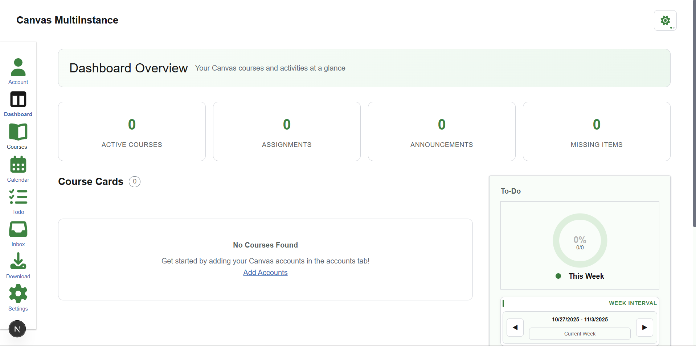

# MultiCanvas

<p align="center">
	
  
</p>

MultiCanvas is an app for dual-enrolled high schoolers — and anyone who likes to stay organized — that brings classes, assignments, and academic info from multiple Canvas domains into one place. Add your Canvas credentials for each domain, and view everything together with a unified Todo list, calendar, and more.

<p align="center">
	
</p>

> Not affiliated with, endorsed by, or sponsored by Instructure. Use at your own discretion.

## Key features

- Todo List: See upcoming and outstanding work across all your connected Canvas accounts in one sidebar.
- Calendar: A modern month view that aggregates assignment events from all courses/domains with clear visual status.
- Offline Download: Export selected courses as a structured, human-readable JSON zip for offline reference or archival.
- Focus “Lock In” Mode: Work through one assignment at a time with details and quick submission flow to minimize distractions.
- Inbox: Read and manage Canvas conversations across accounts.
- In‑App Assignment File Submission: Upload files and submit directly to assignments without leaving the app.

## How it works

- Add Canvas accounts by domain and API token in the app’s Accounts screen. These are stored in your browser’s localStorage (not on a server).
- API requests are routed through the built‑in Next.js API proxy (`/api/canvas`) to avoid CORS issues.
- The UI aggregates data like courses, planner items, calendar events, and messages across all configured accounts.

### Data sources (Canvas API)

MultiCanvas uses common Canvas endpoints, including but not limited to:

- Courses: `GET /api/v1/courses`
- Assignment groups and assignments: `GET /api/v1/courses/:course_id/assignment_groups?include[]=assignments`
- Modules and items: `GET /api/v1/courses/:course_id/modules?include[]=items`
- Pages: `GET /api/v1/courses/:course_id/pages`
- Announcements: `GET /api/v1/courses/:course_id/announcements`
- Discussions (topics): `GET /api/v1/courses/:course_id/discussion_topics`
- Files (metadata): `GET /api/v1/courses/:course_id/files`
- Planner items: `GET /api/v1/planner/items`
- Calendar events: `GET /api/v1/calendar_events`
- Inbox (conversations): `GET /api/v1/conversations`
- Submissions and file upload: `POST /api/v1/courses/:course_id/assignments/:assignment_id/submissions`

## Getting started

### Prerequisites

- Node.js and npm installed

### Install and run (development)

```cmd
npm install
npm run dev
```

The dev server starts on a local port (e.g., http://localhost:3000). Visit the Accounts page in the app to add your Canvas accounts and begin.

### Build and run (production)

```cmd
npm run build
npm start
```

## Using the app

- Accounts (`/accounts`): Add each Canvas domain you use along with a Personal Access Token (API key). These are stored only in your browser.
- Todo (`/todo`): Review upcoming items and quick context across courses.
- Calendar (`/calendar`): View assignment events across all enrolled courses. Submitted items appear visually distinct.
- Offline Download (`/download`): Export creates a zip with readable JSON files per course
- Focus Mode (`/focus`): Work on one assignment at a time, sorted by urgency, with direct upload and submission.
- Inbox (`/inbox`): Read and manage Canvas conversations across accounts.
- Assignment submission: Where supported, upload files and submit without leaving the app.

## Privacy & security

- Your Canvas domains and API tokens are saved in localStorage only on your device. They are used solely to authorize API calls via the app’s proxy.
- No credentials are persisted on a server.
- Consider using MultiCanvas only on trusted devices. Revoke tokens from Canvas if needed.

## License

See the [LICENSE](./LICENSE) file for details.

---

If you have feedback or want to contribute, feel free to open an issue or a PR.

AI was used for this project, including the creation of this README lol.